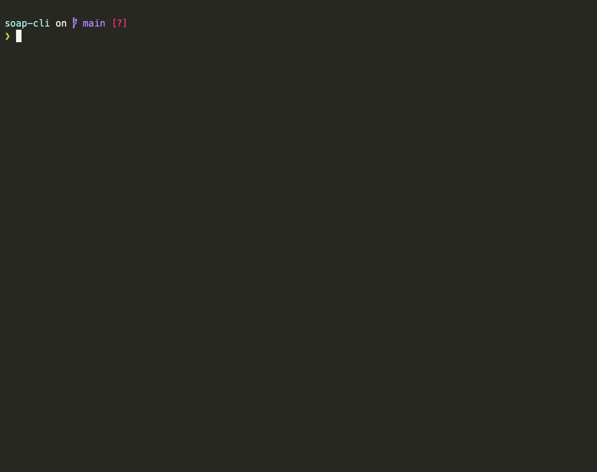

 

# soap-cli
Send SOAP messages from command line like  
```
$ soap <url> <request.xml>
```




## How to install

run: 
```
curl -sL 'https://raw.githubusercontent.com/pmamico/soap-cli/main/install.sh' | bash
```
on Windows, use `Git Bash` or bash enabled `Powershell` **as system administrator**.

### Requirements

* `curl` 
* `xmllint` 
* `xmlstarlet`
* `GNU grep`

Install all requirements

| OS            | via           | command                                                                          |
| ------------- |:-------------:| --------------------------------------------------------------------------:      |
| Ubuntu        | APT           | ```sudo apt-get install libxml2-utils```<br />```sudo snap install xmlstarlet``` |
| MacOs         | [HomeBrew](https://brew.sh/)      | ```brew install xmlstarlet```<br/>```brew install grep```                                        |
| Windows       | [Chocolatey](https://chocolatey.org/)    | ```choco install xmlstarlet```                                                   |
| Windows       | [Cygwin](https://cygwin.com/)<br/>[apt-cyg](https://github.com/transcode-open/apt-cyg) | ```apt-cyg install xmlstarlet```  |

    
## Manual
```
soap-cli v1.0
soap <endpoint> <request> [-i|--interactive] [-u|--update <arg>] [-v|--value <arg>] [-d|--dry] [-h|--help] [--version] [curl options]
	<endpoint>: SOAP endpoint url
	<request>: SOAP request file
	-i, --interactive: use your XML as template, update values interactively before send
	-u, --update: update the the value by given XPath; valid only with --value option
	-v, --value: --value: update the the value by given XPath; valid only with --update option
	-d, --dry: dry run, prints the curl command but do not execute
	-h, --help: Prints help
    All additional arguments and options passed to curl. (curl --help all)
```

### Interactive mode (`--interactive`)
Change the values in the XML in an interactive way.
```
soap <endpoint> <request> --interactive
```
This mode waits for user input for all nodes that presents in the given request and do not have any subnodes.

### Updating a value by XPath (`--update`)

It's possible to update a single value by a given XPath before sending the request, like:
```
soap <endpoint> <request> --update "//nodeName" --value "newValue"
```
Note that this feature is designed to make only a fast change without editing your file, it's not possilbe to stack multiple `--update`.

### Passing curl options  
You can pass any standard curl option **after** `soap-cli` options.  
eg.
```
soap <endpoint> <request> --interactive -o output.xml --http1.0 --verbose
```

### Dry run (`--dry`)
Print the `curl` command which `soap-cli`  would run under the hood without execution.
```
soap <endpoint> <request> --dry
```

## Unit tests
You can run the tests yourself via
```
./unit_test.sh
```
and also get some idea how to use `soap-cli` by reviewing `test/soap_cli_test.sh`.

## Credits

* Followed guides from https://clig.dev/
* SOAP service used for testing: https://documenter.getpostman.com/view/8854915/Szf26WHn
* Testing framework: https://github.com/bats-core/bats-core
* Demo recorded with https://asciinema.org/
* Argument and option parsing generated with https://argbash.io/

