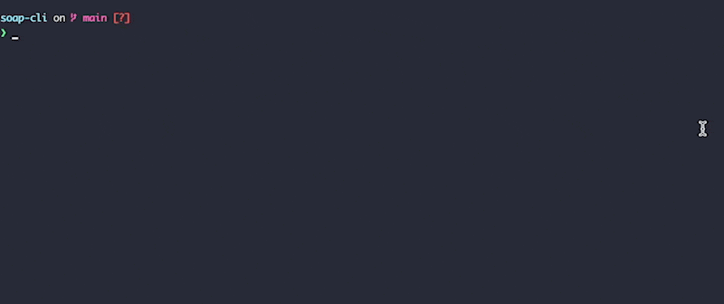

# soap-cli
Send SOAP messages from command line like  
```
$ soap https://eio-soap-sample.herokuapp.com:443/ws sample_request.xml
```


## Demo



## How to install

run: 
```
curl -sL 'https://raw.githubusercontent.com/pmamico/soap-cli/main/install.sh' | bash
```
for windows, use `Git Bash` or bash enabled powershell as system administrator.

### Requirements

* `curl` 
* `xmllint` 
* `xmlstarlet`

    
## Manual
```
soap-cli v0.2
soap <endpoint> <request> [-u|--update <arg>] [-v|--value <arg>] [-h|--help] [curl options]
	<endpoint>: SOAP endpoint url
	<request>: SOAP request file
	-u, --update: update the the value by given XPath; valid only with value option (no default)
	-v, --value: update the the value by given XPath; valid only with update option (no default)
	-h, --help: Prints help
    All additional arguments and options passed to curl. (curl --help all)
```
### Passing curl options 
You can pass any standard curl option **after** soap-cli options.  
eg.
```
soap <endpoint> <request> -o output.xml --http1.0 --verbose
```

## Credits

* Script skeleton generated with https://argbash.io/
* Sample SOAP service used for demostrate: https://github.com/elasticio/soap-sample
