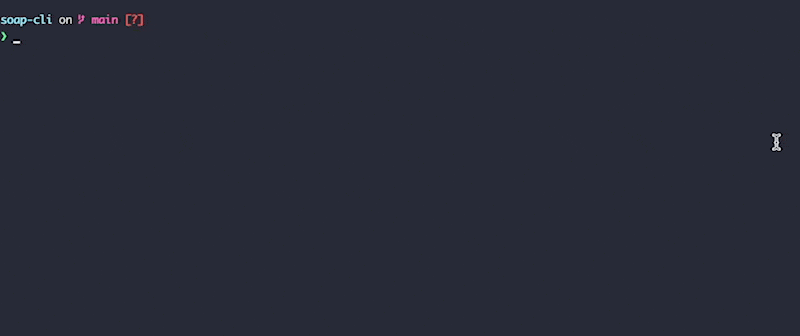

  


# soap-cli
Send SOAP messages from command line like  
```
$ soap https://eio-soap-sample.herokuapp.com:443/ws sample_request.xml
```


## Quick Demo



## How to install

run: 
```
curl -sL 'https://raw.githubusercontent.com/pmamico/soap-cli/main/install.sh' | bash
```
for windows, use `Git Bash` or bash enabled powershell as system administrator.

### Requirements

* `curl` 
* `xmllint` 
* `xmlstarlet`

Install all requirements


  
```sudo apt-get install -y libxml2-utils xmlstarlet```  
  
  
```brew install xmlstarlet``` 

    
## Manual
```
soap-cli v0.3
soap <endpoint> <request> [-u|--update <arg>] [-v|--value <arg>] [-d|--dry] [-h|--help] [--version] [curl options]
	<endpoint>: SOAP endpoint url
	<request>: SOAP request file
	-u, --update: update the the value by given XPath; valid only with value option (no default)
	-v, --value: update the the value by given XPath; valid only with update option (no default)
	-d, --dry: dry run, prints the curl command but do not execute
	-h, --help: Prints help
    All additional arguments and options passed to curl. (curl --help all)
```
### Passing curl options 
You can pass any standard curl option **after** `soap-cli` options.  
eg.
```
soap <endpoint> <request> -o output.xml --http1.0 --verbose
```

### Dry run
Print the `curl` command which `soap-cli`  would run under the hood without execution.
```
soap <endpoint> <request> --dry
```

## Unit tests
You can run the tests yourself via
```
./unit_test.sh
```
and also get some idea how to use `soap-cli` by reviewing `test/soap_cli_test.sh`.

## Credits

* Script skeleton generated with https://argbash.io/
* Sample SOAP service used for demostrate: https://github.com/elasticio/soap-sample
* Testing framework: https://github.com/bats-core/bats-core
